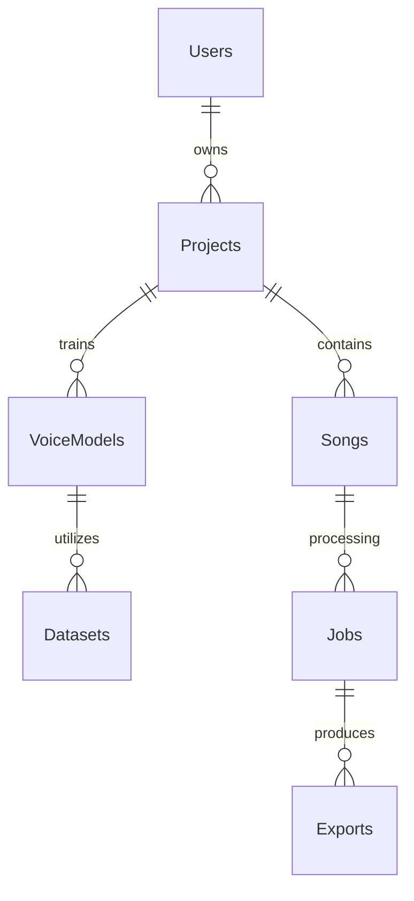

# VoiceForge AI Studio - Database Design

## UUID Strategy
All primary keys will use UUID v7 (for time-sortable capabilities).

## Soft Delete
Every table includes `deleted_at` (nullable). Queries must filter by `deleted_at IS NULL`.

## Audit Fields
Every table includes `created_at` (timestamp), `updated_at` (timestamp).

## ER Diagram (Conceptual)

## Core Tables
- **Users**: id, email, password_hash, role, profile_data
- **Projects**: id, user_id, name, description
- **VoiceModels**: id, user_id, project_id, type, status, metadata, quality_score, inference_compatibility, training_metrics
- **VoiceDatasets**: id, voice_model_id, status, quality_score
- **Songs**: id, project_id, original_file_uuid, status
- **Jobs**: id, song_id, task_type, status, progress, worker_id, retry_count, scheduled_gpu_type
- **Workflows**: id, project_id, dag_definition, status, current_node
- **Exports**: id, job_id, format, file_url
- **AudioCache**: id, hash, type (stem, pitch, transcription), file_url, params, expires_at
- **UsageLogs**: id, user_id, job_id, gpu_seconds, cpu_seconds, storage_bytes, created_at
- **FeatureFlags**: id, key, is_enabled, description
- **AuditLogs**: id, user_id, action, resource_type, resource_id, metadata, created_at
- **ProjectSnapshots**: id, project_id, snapshot_hash, metadata, created_at
- **AICapabilities**: id, model_name, provider, capabilities, memory_req, runtime_est, supported_rates
- **ModelHealth**: id, model_id, avg_runtime, failure_rate, success_rate, last_check, is_healthy
