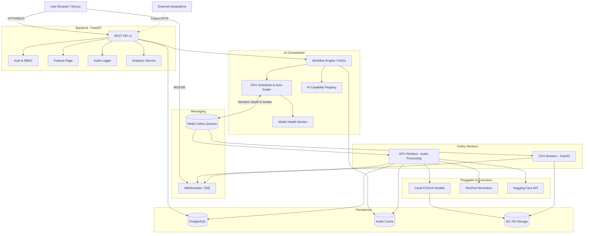

# VoiceForge AI Studio - System Dependency Graph

This document provides the definitive system map for the entire VoiceForge architecture, outlining the flow of data, state, execution, and external integrations.

## Core System Architecture

## Explanation of Subsystems

1. **API Layer**: Handles ingress, validates JWT tokens via `Auth`, checks `Feature Flags` before exposing new capabilities, and writes security events to `Audit`.
2. **Gateway**: The brain of the operation. `Workflow Engine (DAG)` resolves complex chains (Upload -> Separate -> Pitch -> Convert -> Mix -> Master). `Registry` picks the correct model provider, and `Scheduler` scales infrastructure dynamically and queues the tasks.
3. **Workers & Providers**: The stateless celery workers execute jobs. The `AI Providers` interface dictates whether the model is executed locally (bare metal PyTorch) or dispatched to an external API (RunPod, HuggingFace).
4. **Caching & Persistence**: Intermediate steps are stored in `AudioCache` to bypass redundant GPU processing. Final artifacts go to `S3 / R2`, with metadata in `PostgreSQL`.
5. **Real-time Feedback**: `WebSockets / SSE` provides the client with live feedback on pipeline progression without polling.
